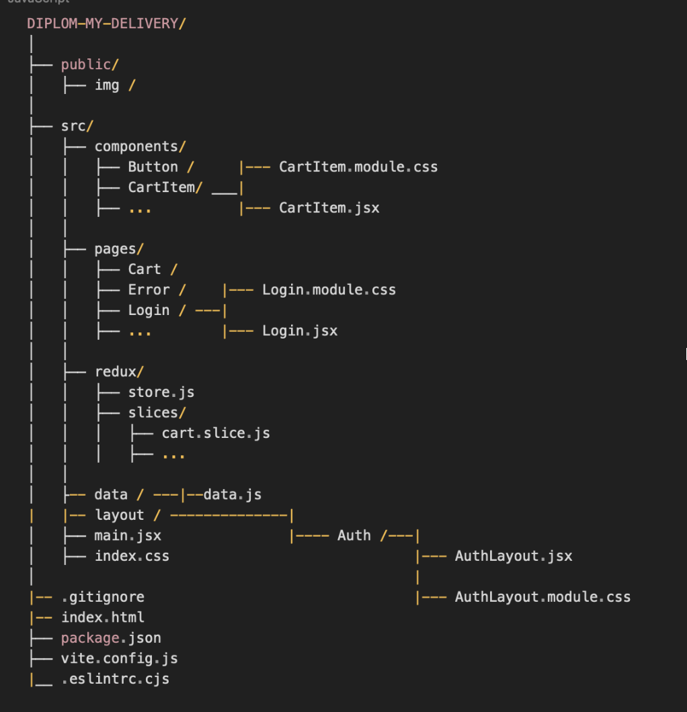

# Веб-приложение для доставки блюд из кафе и ресторанов

## Описание

Данное веб-приложение предоставляет пользователям возможность просматривать каталог блюд, добавлять их в корзину и оформлять заказ на доставку из различных кафе и ресторанов. Приложение разработано с использованием библиотеки React и включает в себя современные технологии и лучшие практики веб-разработки.

## Основные функции

- Просмотр каталога блюд
- Фильтрация и сортировка блюд по цене и рейтингу
- Поиск блюд
- Добавление и удаление блюд из корзины
- Управление количеством блюд в корзине
- Оформление заказа
- Маршрутизация с использованием React Router
- Управление состоянием приложения с помощью Redux

## Структура проекта

Сайт проекта: https://6693dadc2ae3bd5a273aa16f--cheerful-genie-8e3f28.netlify.app/

